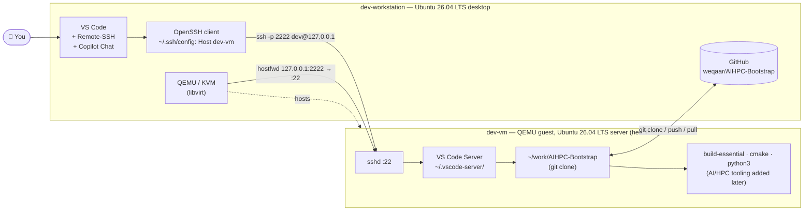

# Project 01 — Dev Environment Setup

> **Goal:** Stand up a reproducible local development environment for the
> AI/HPC curriculum: a bare-metal **dev-workstation**, a headless QEMU
> guest **dev-vm**, and VS Code wired up to develop remotely against the
> VM over SSH.

## Audience & prerequisites

- Audience: college students through experienced professionals.
- Required: a 64-bit x86 machine with hardware virtualization (Intel VT-x
  or AMD-V) enabled in firmware, ≥ 16 GB RAM (32 GB recommended), and
  ≥ 100 GB free disk.
- Assumed familiarity: basic Linux shell usage.

## Target architecture

```
┌─────────────────────────── dev-workstation (host) ───────────────────────────┐
│  Ubuntu 26.04 LTS desktop                                                    │
│  ┌──────────────┐         ┌──────────────────────────────────────────────┐   │
│  │  VS Code     │ ──SSH──▶│  dev-vm (QEMU/KVM guest)                     │   │
│  │  + Remote-SSH│         │  Ubuntu 26.04 LTS server (no GUI)            │   │
│  └──────────────┘         │  user: dev   port: 2222 (host) → 22 (guest)  │   │
│                           └──────────────────────────────────────────────┘   │
└──────────────────────────────────────────────────────────────────────────────┘
```

### Topology (Mermaid)

The same picture as a Mermaid graph — rendered inline by VS Code with
the **Mermaid (Markdown preview)** extension installed below, and by
GitHub directly:



**How to read it.** You drive VS Code on the dev-workstation; VS Code
Remote-SSH tunnels through OpenSSH (`Host dev-vm` → `127.0.0.1:2222`)
into QEMU's user-mode network, which forwards to the guest's `sshd` on
port 22. Once connected, VS Code installs its server side into the VM
and operates on the cloned repository at `~/work/AIHPC-Bootstrap` using
the toolchain installed inside the guest.

---

> **Note on Ubuntu 26.04 LTS.** 26.04 LTS ("Resolute Raccoon", scheduled
> for April 2026) is the targeted release. Until GA images ship, you can
> follow this guide verbatim using **Ubuntu 24.04 LTS** — every command
> below is forward-compatible.

---

## Part 1 — Provision the dev-workstation

### 1.1 Install Ubuntu 26.04 LTS desktop

1. Download the Ubuntu 26.04 LTS Desktop ISO from
   <https://ubuntu.com/download/desktop>.
2. Write it to a USB drive (e.g. with [Rufus](https://rufus.ie/),
   [balenaEtcher](https://etcher.balena.io/), or `dd`):
   ```bash
   sudo dd if=ubuntu-26.04-desktop-amd64.iso of=/dev/sdX bs=4M status=progress conv=fsync
   ```
3. Boot the installer, choose **Interactive installation** → **Default
   selection**, enable **Install third-party software**, and complete
   guided partitioning (LVM + full-disk encryption is recommended for
   laptops).
4. Reboot, finish first-login setup, and apply updates:
   ```bash
   sudo apt update && sudo apt -y full-upgrade
   sudo apt -y autoremove
   ```

### 1.2 Confirm hardware virtualization

```bash
LC_ALL=C lscpu | grep -E 'Virtualization|Vendor ID'
egrep -c '(vmx|svm)' /proc/cpuinfo   # should print a non-zero number
```

If the count is `0`, reboot into firmware (BIOS/UEFI) and enable
**Intel VT-x** or **AMD-V (SVM)**.

### 1.3 Install the virtualization stack

```bash
sudo apt -y install \
    qemu-system-x86 qemu-utils qemu-kvm \
    libvirt-daemon-system libvirt-clients \
    virtinst bridge-utils ovmf cloud-image-utils \
    virt-manager
```

Add yourself to the `kvm` and `libvirt` groups, then re-login (or
`newgrp`):

```bash
sudo usermod -aG kvm,libvirt "$USER"
newgrp libvirt
```

Verify KVM is usable:

```bash
kvm-ok                    # from cpu-checker, install if missing
virsh list --all
```

### 1.4 Install developer baseline tooling

```bash
sudo apt -y install \
    build-essential cmake ninja-build pkg-config \
    git curl wget ca-certificates gnupg lsb-release \
    python3 python3-venv python3-pip \
    openssh-client
```

---

## Part 1b — Terminal configuration (dev-workstation **and** dev-vm)

> **Apply these steps on both machines.** Run them on the
> dev-workstation now, and again inside dev-vm once it is up
> (Part 2). The goal is a consistent, readable terminal with a
> Git-aware prompt everywhere you work.

### Terminal colour scheme

Set your terminal emulator's default profile to **green text on a black
background**:

| Property   | Value              |
| ---------- | ------------------ |
| Foreground | `rgb(31, 214, 85)` — bright green |
| Background | `rgb(0, 0, 0)`     — pure black   |

This matches the **Campbell PowerShell** colour scheme shipped with
Windows Terminal. We don't use Windows, Windows Terminal, or PowerShell
— the reference is only to name the palette so you can look it up if you
want the full 16-colour table.

**GNOME Terminal** (default on Ubuntu desktop):

1. Open **Preferences → Profiles → Unnamed** (or create a new profile).
2. Under **Colors**, uncheck *Use colors from system theme*.
3. Set **Default color → Text** to `#1FD655` and **Background** to
   `#000000`.

**VS Code integrated terminal** — add to your User `settings.json`
(`Ctrl+Shift+P` → *Preferences: Open User Settings (JSON)*):

```jsonc
"workbench.colorCustomizations": {
    "terminal.foreground": "#1FD655",
    "terminal.background": "#000000"
}
```

### Git-aware Bash prompt

We use Git's official `git-prompt.sh` helper to show branch, dirty
state, and upstream status right in the shell prompt.

#### 1. Install `git-prompt.sh`

The script ships with Git but isn't always on `$PATH`. Copy it to a
shared location:

```bash
sudo mkdir -p /opt/bin
sudo cp /usr/lib/git-core/git-prompt.sh /opt/bin/git-prompt.sh
sudo chmod 644 /opt/bin/git-prompt.sh
```

> **Tip.** The file location may vary by distro. If the path above
> doesn't exist, try `dpkg -L git | grep git-prompt` or
> `find / -name git-prompt.sh 2>/dev/null`.

#### 2. Configure `~/.bashrc`

Open `~/.bashrc` and **replace** the default prompt section (the block
that sets `PS1`) with the snippet below. If you prefer, append it at the
end — just make sure an earlier line doesn't override `PS1` afterwards.

```bash
# --------------- Git prompt ------------------------------------------------
source /opt/bin/git-prompt.sh
export GIT_PS1_SHOWDIRTYSTATE=1
export GIT_PS1_SHOWUPSTREAM="auto"
export GIT_PS1_SHOWSTASHSTATE="n"
export GIT_PS1_SHOWUNTRACKEDFILES="n"

if [ "$color_prompt" = yes ]; then
    PS1='\[\e[1;35m\]\u\[\e[m\]@\[\e[01;36m\]\h\[\e[m\] \[\e[01;33m\]\W\[\e[m\]$(__git_ps1 " \[\e[01;34m\]($(basename "$(git rev-parse --show-toplevel 2>/dev/null)"):\[\e[m\]\[\e[01;31m\]%s\[\e[m\]\[\e[01;34m\])\[\e[m\]")\$ '
else
    PS1='${debian_chroot:+($debian_chroot)}\u@\h:\w\$ '
fi
unset color_prompt force_color_prompt
# ---------------------------------------------------------------------------
```

**What the colour prompt gives you:**

```
user@host AIHPC-Bootstrap (AIHPC-Bootstrap:main *)$
 ^         ^                ^                  ^
 magenta   cyan             blue repo:red branch  * = dirty
```

- `\u` (user) — **bold magenta**
- `\h` (hostname) — **bold cyan**
- `\W` (current dir basename) — **bold yellow**
- repo name — **bold blue**
- branch + dirty/upstream — **bold red**

#### 3. Reload

```bash
source ~/.bashrc
```

Navigate into a Git repository and you should see the coloured prompt
with branch info.

---

## Part 2 — Build the **dev-vm** (headless Ubuntu 26.04 LTS)

We use the official Ubuntu **cloud image** + **cloud-init** so the VM is
fully unattended and reproducible. The VM is **server / no GUI**.

### What is cloud-init, and why do we need it?

[cloud-init](https://cloud-init.io/) is a lightweight service that runs
on the very first boot of a Linux image and **automatically configures**
things you would otherwise have to do by hand: creating users, injecting
SSH keys, setting the hostname, installing packages, etc.

Despite the name, **cloud-init has nothing to do with using a cloud
provider.** The word "cloud" is historical — the tool was originally
written to provision VMs in cloud environments (AWS, Azure, GCP), but it
works equally well on a local QEMU/KVM guest, a Vagrant box, or bare
metal. We are using it here purely as a convenient, scriptable way to
set up our local VM without clicking through an installer or manually
editing config files after boot.

In practice this means:

1. We download a pre-built Ubuntu **cloud image** (a compressed,
   minimal disk image published by Canonical — no installer needed).
2. We write a small YAML file (`user-data`) describing how we want the
   VM configured (username `dev`, our SSH public key, packages to
   install).
3. We package that YAML into a tiny `seed.iso` and pass it to QEMU.
4. On first boot cloud-init reads the seed, applies the config, and the
   VM comes up fully ready — no manual intervention required.

This is the same workflow used to spin up thousands of identical VMs in a
data centre, just running on your laptop for one VM.

### 2.1 Lay out a working directory

```bash
mkdir -p ~/vms/dev-vm && cd ~/vms/dev-vm
```

### 2.2 Download the cloud image

```bash
# When 26.04 ships, use that filename. Until then, swap "noble" (24.04).
IMG=ubuntu-26.04-server-cloudimg-amd64.img
wget -O base.img "https://cloud-images.ubuntu.com/releases/26.04/release/${IMG}"
```

### 2.3 Resize the disk (give it room to grow)

```bash
qemu-img create -f qcow2 -F qcow2 -b base.img dev-vm.qcow2 60G
```

### 2.4 Create cloud-init seed (user, SSH key, hostname)

Generate an SSH key on the workstation if you don't already have one:

```bash
[ -f ~/.ssh/id_ed25519 ] || ssh-keygen -t ed25519 -C "dev-workstation" -N "" -f ~/.ssh/id_ed25519
PUBKEY=$(cat ~/.ssh/id_ed25519.pub)
```

Create `user-data`:

```bash
cat > user-data <<EOF
#cloud-config
hostname: dev-vm
manage_etc_hosts: true
users:
  - name: dev
    groups: [sudo]
    sudo: ALL=(ALL) NOPASSWD:ALL
    shell: /bin/bash
    ssh_authorized_keys:
      - ${PUBKEY}
package_update: true
package_upgrade: true
packages:
  - openssh-server
  - build-essential
  - git
  - curl
  - python3
  - python3-venv
  - python3-pip
ssh_pwauth: false
EOF

cat > meta-data <<'EOF'
instance-id: dev-vm-001
local-hostname: dev-vm
EOF

cloud-localds seed.iso user-data meta-data
```

### 2.5 Boot the VM (headless, port-forward 2222 → 22)

Save this as `~/vms/dev-vm/run.sh` and `chmod +x` it:

```bash
#!/usr/bin/env bash
set -euo pipefail
cd "$(dirname "$0")"

exec qemu-system-x86_64 \
  -name dev-vm \
  -machine type=q35,accel=kvm \
  -cpu host -smp 4 -m 8192 \
  -drive file=dev-vm.qcow2,if=virtio,format=qcow2 \
  -drive file=seed.iso,if=virtio,format=raw \
  -netdev user,id=n0,hostfwd=tcp:127.0.0.1:2222-:22 \
  -device virtio-net-pci,netdev=n0 \
  -nographic -serial mon:stdio
```

First boot will run `cloud-init`; expect 1–3 minutes before SSH is up.
Watch the serial console for the login prompt, then leave it running and
move on. (To stop later: from the QEMU monitor, `Ctrl-a x`, or
`ssh dev@... 'sudo poweroff'`.)

> **Tip.** For a "real" service, prefer `libvirt` + `virt-install` so the
> VM is managed by `systemd` and auto-starts. The QEMU one-liner above is
> kept for transparency and learning.

### 2.6 First SSH from the workstation

```bash
ssh-keygen -R '[127.0.0.1]:2222' 2>/dev/null || true
ssh -p 2222 dev@127.0.0.1
```

Add a friendly host alias so VS Code (and you) can use `dev-vm`:

```bash
mkdir -p ~/.ssh && chmod 700 ~/.ssh
cat >> ~/.ssh/config <<'EOF'

Host dev-vm
    HostName 127.0.0.1
    Port 2222
    User dev
    IdentityFile ~/.ssh/id_ed25519
    ForwardAgent yes
    ServerAliveInterval 30
EOF
chmod 600 ~/.ssh/config
ssh dev-vm 'hostnamectl; uname -a'
```

---

## Part 3 — Install & configure VS Code on the dev-workstation

### 3.1 Install VS Code

```bash
sudo install -d -m 0755 /etc/apt/keyrings
wget -qO- https://packages.microsoft.com/keys/microsoft.asc \
  | sudo gpg --dearmor -o /etc/apt/keyrings/packages.microsoft.gpg
echo "deb [arch=amd64 signed-by=/etc/apt/keyrings/packages.microsoft.gpg] \
https://packages.microsoft.com/repos/code stable main" \
  | sudo tee /etc/apt/sources.list.d/vscode.list
sudo apt update && sudo apt -y install code
```

### 3.2 Install the required extensions

The `code` CLI installs extensions by Marketplace ID. Run:

```bash
for ext in \
  ms-vscode-remote.remote-ssh \
  ms-vscode.remote-explorer \
  vscodevim.vim \
  ms-vscode.cpptools \
  ms-vscode.cpptools-extension-pack \
  ms-vscode.cpptools-themes \
  ms-vscode.cmake-tools \
  james-yu.latex-workshop \
  ms-vscode.makefile-tools \
  ms-python.python \
  ms-python.vscode-python-envs \
  humao.rest-client \
  redis.redis-for-vscode \
  redhat.vscode-yaml \
  github.copilot-chat \
  bierner.markdown-mermaid ; do
    code --install-extension "$ext" --force
done
```

| Requested name              | Marketplace extension                          |
| --------------------------- | ---------------------------------------------- |
| Remote - SSH                | `ms-vscode-remote.remote-ssh`                  |
| Remote Explorer             | `ms-vscode.remote-explorer`                    |
| Vim                         | `vscodevim.vim`                                |
| C/C++                       | `ms-vscode.cpptools`                           |
| C/C++ DevTools (themes)     | `ms-vscode.cpptools-themes`                    |
| C/C++ Extension Pack        | `ms-vscode.cpptools-extension-pack`            |
| CMake Tools                 | `ms-vscode.cmake-tools`                        |
| LaTeX (LaTeX Workshop)      | `james-yu.latex-workshop`                      |
| Makefile Tools              | `ms-vscode.makefile-tools`                     |
| Python                      | `ms-python.python`                             |
| Python Environments         | `ms-python.vscode-python-envs`                 |
| REST Client                 | `humao.rest-client`                            |
| Redis                       | `redis.redis-for-vscode`                       |
| YAML                        | `redhat.vscode-yaml`                           |
| GitHub Copilot Chat         | `github.copilot-chat`                          |
| Mermaid (Markdown preview)  | `bierner.markdown-mermaid`                     |

Verify:

```bash
code --list-extensions
```

---

## Part 4 — Connect VS Code to **dev-vm** and clone the repo

1. Launch **VS Code** on the dev-workstation.
2. Open the Command Palette (`Ctrl+Shift+P`) and run
   **Remote-SSH: Connect to Host…** → choose **dev-vm** (from the
   `~/.ssh/config` alias). A new VS Code window opens; the green status
   bar in the bottom-left should read `SSH: dev-vm`.
3. The first time, VS Code installs its remote server into
   `~/.vscode-server/` on the VM — wait for it to finish.
4. Open a new integrated terminal: **Terminal → New Terminal** (or
   ``Ctrl+` ``). It will be a `bash` shell **on dev-vm**.
5. Clone the curriculum repo on the VM:
   ```bash
   mkdir -p ~/work && cd ~/work
   git clone https://github.com/weqaar/AIHPC-Bootstrap.git
   cd AIHPC-Bootstrap
   ```
6. In VS Code: **File → Open Folder…** → `/home/dev/work/AIHPC-Bootstrap`.
   The window reloads with the project rooted on the VM. Extensions that
   need to run on the remote (C/C++, CMake Tools, Python, Makefile Tools,
   YAML, REST Client, LaTeX Workshop) will offer to **Install in SSH:
   dev-vm** — accept.

You now have a clean Ubuntu 26.04 LTS guest, edited and built from VS
Code on your host, with the curriculum repo checked out.

---

## Verification checklist

- [ ] `egrep -c '(vmx|svm)' /proc/cpuinfo` ≥ 1 on the host
- [ ] `virsh list --all` runs without `sudo`
- [ ] `ssh dev-vm 'lsb_release -ds'` reports Ubuntu 26.04 LTS
- [ ] `ssh dev-vm 'systemctl is-system-running'` is `running` or `degraded`
      (no failed services you care about)
- [ ] VS Code green status bar shows `SSH: dev-vm`
- [ ] `code --list-extensions` on the host includes all 14 IDs above
- [ ] `git -C ~/work/AIHPC-Bootstrap rev-parse --abbrev-ref HEAD` (run on
      dev-vm) prints `main`

## Troubleshooting

- **`/dev/kvm` permission denied** — ensure you're in the `kvm` group
  (`id`) and that you logged out/in (or used `newgrp kvm`).
- **VM SSH refuses connection** — cloud-init may still be running on
  first boot. Tail the serial console; wait for `cloud-init` to finish.
- **Host key changed warning** — every fresh VM has a new host key;
  `ssh-keygen -R '[127.0.0.1]:2222'` clears the old entry.
- **VS Code "Could not establish connection"** — confirm `ssh dev-vm`
  works from a normal terminal first; VS Code Remote-SSH uses the same
  config.
- **Slow VM disk** — make sure you used `if=virtio` and that your host
  filesystem isn't on a slow USB drive.

## Commit & AI attribution

Once you start contributing back to this repo from `dev-vm`, follow
[`ai/COMMIT_GUIDELINES.md`](../../ai/COMMIT_GUIDELINES.md). Summary:

- Use `Signed-off-by:` (only humans) on every commit.
- When an AI assistant (e.g. GitHub Copilot Chat) helped produce the
  change, add a trailer of the form:
  ```
  Assisted-by: AGENT_NAME:MODEL_VERSION [TOOL1] [TOOL2]
  ```
- Do **not** use `Co-authored-by: Copilot` (or any `Co-authored-by:`
  for an AI agent).

This follows the Linux kernel project's
[coding-assistants guidance](https://docs.kernel.org/process/coding-assistants.html).

## Next steps

With dev-workstation + dev-vm + VS Code in place you're ready for the
next project in `projects/`, which will start layering AI/HPC tooling
(CUDA / ROCm where applicable, MPI, container runtimes, profilers) onto
this base.
